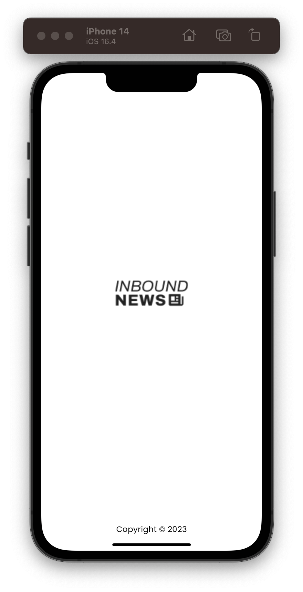
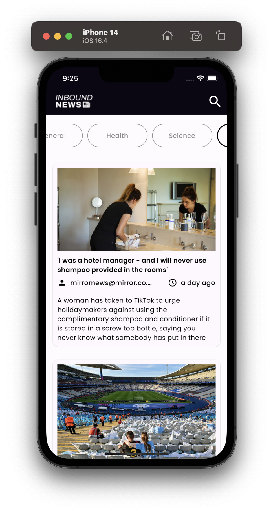
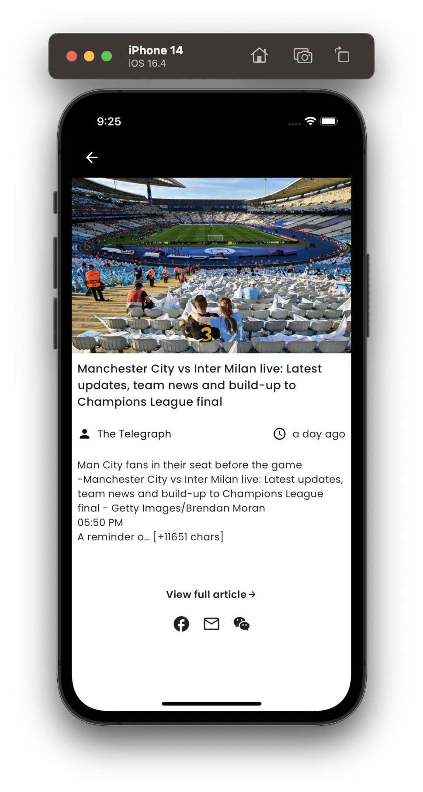

# Flutter News App

A simple News application built with Flutter. The news data fetch using a Free REST API provided by NewsAPI.org.

## How to run this project

Clone this repository using following command.

`https://github.com/kajalpandey0104/News-App-Flutter`

Then navigate to the project & install the libraries using following command.

`flutter pub get`

Go the [newsapi.org](https://newsapi.org) REST API and create an account.

Go to the `assets/.env` and replace the **API KEY** that you created in previous step.

## App UI's

|   |  |
|--|--|
|  |  |
